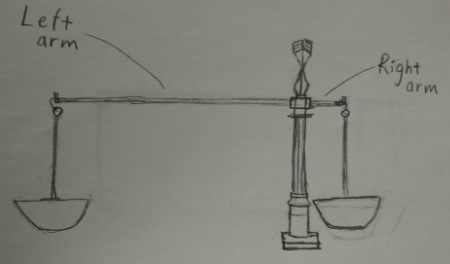

Historically, the agricultural experiment is the earliest application area on Design of Experiments.
This document is an example about how designs can affect experiments. It includes a method for weighing products with better precision, a test on whether the nitrogen fertilizer affects the crops, and an A/B test for two strategies.
Currently, there are many packages that can be found in RCAN. However, in this example, only "pwr" package is used for A/B testing. For more details on other packages, please refer to
[CRAN Task View: Design of Experiments (DoE) & Analysis of Experimental Data](https://cran.r-project.org/web/views/ExperimentalDesign.html)
and
[Design of Experiments in R](https://www.r-project.org/conferences/useR-2011/TalkSlides/Invited/Gromping-Design_of_Experiments.pdf)
(the invited talk at [The R User Conference 2011](https://www.r-project.org/conferences/useR-2011/)) by [Ulrike Groemping](https://prof.beuth-hochschule.de/groemping/?L=1).


  
```{r setup, include=FALSE}
suppressMessages(library(pwr, warn.conflicts = FALSE))
```


### Weighing three balls with a new balance

The "balls" here can be livestocks, crops, and any other products in industries. The goal is to weight them with smaller variation, which means better precision. This idea was inspired by an example on
[Wikipedia](https://en.wikipedia.org/wiki/Design_of_experiments).

Let's suppose the variance of measures is $\sigma^2$ (of cause, in i.i.d. situations). If we use the balance in Figure 1, and we weigh one object (i.e. one ball) at a time, then the variance is certainly $\sigma^2$.

<center>

)](Balance1.JPG)

</center>

If we use the design introduced in [Wikipedia](https://en.wikipedia.org/wiki/Design_of_experiments) (i.e. let $B_i, (i=1,2,3)$ stand for three balls, and $Y_j, j=1, 2, 3, 4,$ are measued differences described in the following table), then the weight of each ball can be estimated by the following formulas:

Steps | Left Pan | Right Pan | Measured Difference
---------|------|---------|------
step 1 | $B_1$,  $B_2$,  $B_3$| empty | $Y_1= (B_1+B_2+B_3)-0$
step 2 | $B_1$, $B_3$ | $B_2$ | $Y_2= (B_1+B_3) - B_2$
step 3 | $B_2$, $B_3$ | $B_1$ | $Y_2= (B_2+B_3) - B_1$
step 4 | $B_1$, $B_2$ | $B_3$ | $Y_2= (B_1+B_2) - B_3$


$$
\mbox{estimated weight of }B_1=\frac{Y_1+Y_2-Y_3+Y_4}{4},
$$
$$
\mbox{estimated weight of }B_2=\frac{Y_1-Y_2+Y_3+Y_4}{4},
$$
$$
\mbox{estimated weight of }B_3=\frac{Y_1+Y_2+Y_3-Y_4}{4}.
$$
Now, since measures are i.i.d., the variance of the estimation becomes $\sigma^2/4$, which implies higher precision.

However, this design is hard to use for practice problems when the number of objects is greater, when the objects are hard to be measured more than once, or when the balance limitation is surpassed. Therefore, I suggest the following newly-designed balance:

<center>



</center>

Let's suppose the "left arm" is $k$ times the length of the "right arm" in this new balance. Then it should give us $k^2$ times as much precision than the old balance does.


### Nitrogen fertilizer for corn.

This example is from the book [*Experimental Design and Analysis*](http://www.stat.cmu.edu/~hseltman/309/Book/Book.pdf) by [Howard J. Seltman](http://www.stat.cmu.edu/people/faculty/howard-seltman), and the corn data set is downloaded from his [website](http://www.stat.cmu.edu/~hseltman/309/Book/data/corn.dat). The goal is to evaluate whether the nitrogen fertilizer benefits the weight of corn.

We assume the effects of nitrogen fertilizer is linear to the corn weight, i.e. $\mathbb{E}(weight| nitrogen)=\beta_0+\beta_1nitrogen$. Then the statistical hypotheses are

H0 : $\beta_1 = 0$.

H1 : $\beta_1 \neq 0$.

By using the simple linear regression, we have the following summary for the fitted model.
```{r, eval=TRUE, echo=FALSE, message=FALSE, warning=FALSE}
corns <- read.table("http://www.stat.cmu.edu/~hseltman/309/Book/data/corn.dat", header = TRUE)
m1 <- lm(weight~nitrogen, data = corns)
summary(m1)
```

The above shows $\beta_1$ is estimated as `r round(as.numeric(m1$coefficients[2]),4)`, and the nitrogen fertilizer significantly and positively contributes to the weight of corn. Therefore, the benefits of the nitrogen fertlizer cannot be ignored (i.e. H0 is rejected) by farmers.


### R package "pwr" for A/B testing

We repeatedly assume that there are two strategies for planting corn, with Strategy A using nitrogen fertilizer, and Strategy B not using nitrogen fertilizer. Let's suppose 1000 farming plots were examined and measured, and 100 of them were found to be converted, gaining weight. Details are listed in the following table:

Strategies | Number of Plots | Number of Converted Plots |
---------|------|---------|------
A | 520 | 62 |
B | 480 | 38 |

The statistical hypotheses are:

H0: there is **no** difference between Strategy A and Strategy B.

H1: there **exits** a difference between Strategy A and Strategy B.

Since the difference between two strategies could be either positive or negative, we will use the two-tail test in the "prop.test" function. We have the following output:
 
```{r, eval=TRUE, echo=FALSE, message=FALSE, warning=FALSE}
prop.test(c(62, 38), c(520,480))

```

As we can see, the p-value is 0.045. It means under the 5% significant level, so we can reject the hypothesis that conversion rates are equal, and take Strategy A for having a better harvest.


The "pwr" package can also provide recommendations for the sample size.
For example, we want to use 520 plots as the sample for Strategy A, and we set the Type I error to less than 5%, the Type II error to less than 15%, and assume the effect size to be h = 0.2, in the "pwr.2p2n.test" function. Then, we have the following output:


```{r, eval=TRUE, echo=FALSE, message=FALSE, warning=FALSE}
pwr.2p2n.test(h=0.2, n1=520, sig.level=0.05, power=0.85)
```

Based on the above, the suggested sample size for Strategy B is at least 395.


